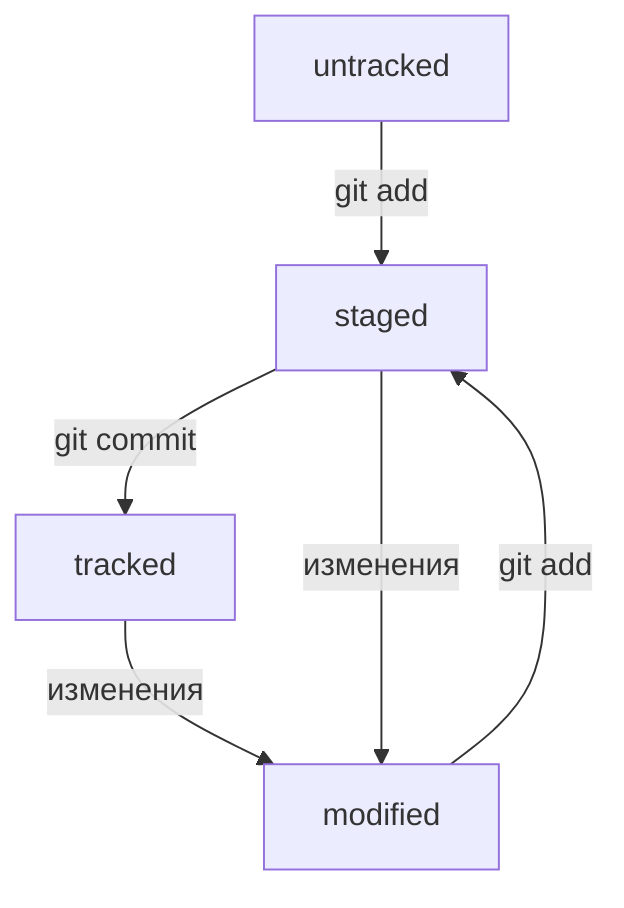

# Начало работы с git.

Скачиваем git. Устанавливаем.

## СОЗДАЁМ ЛОКАЛЬНЫЙ РЕПОЗИТОРИЙ:

Создаём папку с проектом.

Перейти в папку > git itit > папка стала репозиторием, мы её инициализировали

rm -rf .git > Чтобы разгитить папку 

git status > check repository status

git add 'file name' > добавить файл в репозиторий
git add --all > добавить все файлы
git add . > добавить всю папку

После сохранения (после каждого изменения файла его вновь нужно сохранять) файла в репозиторий добавляем коммит

git commit -m 'texttexttext'

git commit > выведет информацию о коммите

git log > выведет историю коммитов

## СОЗДАЁМ УДАЛЁННЫЙ РЕПОЗИТОРИЙ:

Регистрируемся на GitHub

SSH — протокол, который обеспечивает безопасный обмен данными в сети и использует для этого ключи.

ls -la .ssh/ > проверить наличие ssh-ключей
ls -a ~/.ssh

Генирируем SSH-ключи

$ ssh-keygen -t ed25519 -C "email"
или
$ ssh-keygen -t rsa -b 4096 -C "email"

> Enter a file in which to save the key (C:\Users\<имя_пользователя>\.ssh\):[Press enter]

clip < ~/.ssh/id_rsa.pub

New SSH-key на GitHub

В поле key вставить

$ ssh -T git@github.com > проверить правильность ключа

## СВЯЗЫВАЕМ ЛОКАЛЬНЫЙ И УДАЛЁННЫЙ РЕПОЗИТОРИИ:

Скопировать URL SSH-ключа на GitHub

Перейти в папку проекта

git remote add origin скопированная_ссылка

git remote -v > убеждаемся, что репозитории связаны

git push -u origin master > синхронизируем репозитории в первый раз
git push > во все следующие разы

## Навигация по коммитам. Статусы файлов.

**Хеш** — основной идентификатор коммита и позволяет узнать его автора, дату и содержимое закоммиченных файлов.

При использовании git log появится список коммитов и описание к ним:

* строка из цифр и латинских букв после слова commit — это хеш коммита;
* Author — имя автора и его электронная почта;
* Date — дата и время создания коммита;
* в конце находится сообщение коммита.

Можно вызвать не только полный лог, но и сокращённый — это делается командой **git log --oneline**.
В сокращённом логе выводятся сокращённые хеши — их можно использовать точно так же, как и полные.

В числе прочих файлов в папке .git есть служебный файл **HEAD**. Он указывает на самый свежий коммит.
Вместо хеша последнего коммита можно написать слово HEAD — Git вас поймёт.

Основные **статусы** в git:
* **untracked** (англ. «неотслеживаемый») - git не следит за его изменениями
* **staged** (англ. «подготовленный») - список файлов, которые войдут в коммит
* **tracked** (англ. «отслеживаемый») - файлы, которые добавлены или изменены, или закоммичены
* **modified** (англ. «изменённый») - что-то изменили в файле, но не добавили его

Жизненный цикл файлов в Git:

**git status** показывает следующие состояния файлов:
* staged (Changes to be committed в выводе git status);
* modified (Changes not staged for commit);
* untracked (Untracked files).